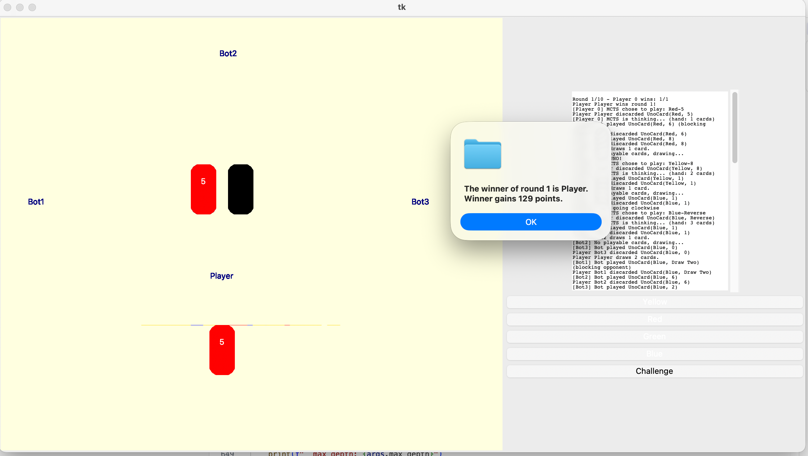

# UNO Game with MCTS AI - User Guide

## Overall
This project implements an intelligent decision-making agent for the UNO game using Monte Carlo Tree Search (MCTS) in Python.

Team members: Zeyuan Yang, Sylvester Ampomah, William Gumirov

Assertation: the origin uno.py code is from rosettacode: https://rosettacode.org/wiki/Uno_%28Card_Game%29/Python

The project proposal link: https://docs.google.com/document/d/1lqPSJrU0hT_-SkirGtzunnhGH_FmyiyNoczw3AZcXrY/edit?usp=sharing

The project deployment to website link: https://sylvester107.github.io/UNO-AI-Algorithm/

## Problem statement
As a player in the UNO game, we always want to win the game. But sometimes we human are not always making optimal choice to play the cards. So let's use a better algorithm to help us win the game!

The rules of the game (what is a UNO game) can be learned by: **Game_description.md** We have 4 players in the game, the **player 0 will be the MCTS agent**, and player 1, player 2, and player 3 will be run without MCTS -- only base on rosetta basic logic.

## Related solutions
We have searched that, someone has already used MCTS and Q-Learning for this game decision before.

## State space, actions, transitions, and observations
As what we did before in milestone 1, this part can be refer from **GameState_Representation.md** and **Zeyuan_Draft_Report_and_State_Space.md**

We can also talk about it again.

A game state includes the following components:

- **Player Information**: Each player's hand (cards), score, and whether they are a bot (the other players our algorithm will be playing with)

- **Deck State**: Draw pile (ordered list of cards), discard pile (top card is visible)

- **Turn State**: Current player index (`pnow`), play direction (clockwise but can go anticlockwise), active color (`colornow`), last color (`lastcolor`)

- **Command State**: Whether the top discard's command is still active (`commandsvalid`)

- **Round State**: Current round number

---

## Mathematical Description

### 1. Players (P)

\[ P = \{p_0, p_1, p_2, p_3\} \]

Each player \( p_i \) is a tuple:

\[ p_i = (H_i, S_i, B_i) \]

- **\( H_i \)**: Hand of cards
  \[ H_i = \{c_1, c_2, \ldots, c_{|H_i|}\} \]

- **\( S_i \)**: Cumulative score (non-negative integer)
  \[ S_i \in \mathbb{Z}_{\geq 0} \]

- **\( B_i \)**: Bot indicator
  - \( B_i = 1 \): Bot player
  - \( B_i = 0 \): MCTS agent (Player 0)

---

### 2. Deck (D)

\[ D = (D_{\text{draw}}, D_{\text{discard}}) \]

- **Draw Pile** \( D_{\text{draw}} \):
  \[ D_{\text{draw}} = [c_1, c_2, \ldots, c_n] \]
  *(Note: Top card is the last element)*

- **Discard Pile** \( D_{\text{discard}} \):
  \[ D_{\text{discard}} = [c_1, \ldots, c_k] \]
  *(Note: Top card is \( c_k \))*

---

### 3. Turn State (T)

\[ T = (p_{\text{now}}, d, c_{\text{now}}, c_{\text{last}}, v) \]

- **\( p_{\text{now}} \)**: Index of current player
  \[ p_{\text{now}} \in \{0, 1, 2, 3\} \]

- **\( d \)**: Play direction
  - \( d = +1 \): Clockwise
  - \( d = -1 \): Counter-clockwise

- **\( c_{\text{now}} \)**: Active color
  \[ c_{\text{now}} \in \{\text{Blue}, \text{Green}, \text{Red}, \text{Yellow}, \text{Wild}\} \]

- **\( c_{\text{last}} \)**: Previous color before last change
  \[ c_{\text{last}} \in \{\text{Blue}, \text{Green}, \text{Red}, \text{Yellow}, \text{Wild}\} \]

- **\( v \)**: Command resolution flag
  - \( v = 1 \): Top discard card's command is pending
  - \( v = 0 \): Command already resolved

---

### 4. Card Definition (C)

Each card is a tuple:

\[ c = (\text{color}, \text{type}) \]

- **Colors**:
  \[ \text{color} \in \{\text{Blue}, \text{Green}, \text{Red}, \text{Yellow}, \text{Wild}\} \]

- **Types**:
  \[ \text{type} \in \{0\text{--}9, \text{Skip}, \text{Reverse}, \text{Draw Two}, \text{Wild}, \text{Draw Four}\} \]

---

### 5. Round (R)

\[ R \in \mathbb{Z}_{> 0} \]

The current round number in the race to 500 points.

---
### Actions = {V_Card, Next_Col, Plus_N, Sk, Rev}U{GNC}U{UNO}

Where:
- V_Card: Use a valid card from hand(same color or same number), 
- Next_Col: Choose the next color for the wild card when play a wild card,
- Plus_N: Play a +2 or +4 wild card
- Sk: Play a skip card, will skip next player, skip'= 1
- Rev: Play a reverse card, will reverse the current direction, Cur_Dir' = -Cur_Dir
- GNC: Get a new card if there are no valid cards in hand
- UNO: When player has only left 2 hand cards, should do "UNO" action, announce to others; or else he will be penal by add 2 cards

### Transitions: S' <- T(S,A)

- Means, in state S, take action A, will go to state S'

    Including transitions:
    - Cur_Top' = A.V_Card
    - Cur_Col' = A.Next_Col
    - Cur_Dir' = - Cur_Dir, when A = A.Rev
    - Skip' = 1, when A = A.Sk
    - Sum_Plus' += k, where k={2,4}, when A=A.Plus_N
    - Hand_Cards' = Hand_Cards.append(card), when A = A.GNC


### Observations
observations are parts of the whole game state
O(S) = (Cur_Col, Cur_Dir, Cur_Top, Skip, Sum_Plus, Hand_Cards, Opponents_Cards_Num, B)


## Solution method
We are using Monte Carlo Tree Search(MCTS). Detailly, with the algorithm inside is the UCB1 and POMDP, with practicle filter to get the belif of opponent's hand cards.

## Quick Start

### Basic Usage

```bash
# Run the game with default parameters
python uno.py
```

### View Help Information

```bash
python uno.py --help
```

## Command Line Arguments

### MCTS Algorithm Parameters

#### `--gamma` (float, default: 0.99)
- **Description**: Discount factor for MCTS, used for reward decay during backpropagation
- **Range**: Typically between 0.9 and 1.0
- **Example**: 
  ```bash
  python uno.py --gamma 0.95
  ```

#### `--c_param` (float, default: 1.4)
- **Description**: Exploration parameter for UCB1 algorithm, controls exploration-exploitation balance
- **Range**: Typically between 1.0 and 2.0
  - Smaller values: More biased towards exploiting known good actions
  - Larger values: More biased towards exploring unknown actions
- **Example**:
  ```bash
  python uno.py --c_param 2.0
  ```

#### `--max_depth` (int, default: 20)
- **Description**: Maximum depth for MCTS rollout, limits the depth of simulation search
- **Range**: Recommended 10-30, larger values search deeper but take longer
- **Example**:
  ```bash
  python uno.py --max_depth 25
  ```

#### `--num_particles` (int, default: 100)
- **Description**: Number of belief particles for POMDP (Partially Observable Markov Decision Process)
- **Description**: Used to handle uncertainty about opponent hands
- **Range**: Recommended 50-200, more particles are more accurate but slower
- **Example**:
  ```bash
  python uno.py --num_particles 150
  ```

#### `--num_simulations` (int, default: 500)
- **Description**: Number of MCTS simulations per decision
- **Description**: This is the most important performance parameter, directly affects AI decision quality
- **Range**: Recommended 100-2000
  - Few (100-300): Fast decisions, suitable for testing
  - Medium (500-1000): Balanced quality and speed
  - Many (1000+): High-quality decisions, but time-consuming
- **Example**:
  ```bash
  python uno.py --num_simulations 1000
  ```

### Game Control Parameters

#### `--use_mcts` (flag, default: True)
- **Description**: Enable MCTS AI to control Player 0
- **Description**: This is the default behavior, usually no need to explicitly specify
- **Example**: Enabled by default, no additional parameter needed

#### `--no_mcts`
- **Description**: Disable MCTS, use manual clicking to control Player 0
- **Description**: With this option, Player 0 requires manual clicking to play cards
- **Example**:
  ```bash
  python uno.py --no_mcts
  ```

#### `--num_rounds` (int, default: 10)
- **Description**: Number of rounds to play
- **Range**: Any positive integer
- **Description**: Game will also end early if any player reaches 500 points
- **Example**:
  ```bash
  python uno.py --num_rounds 5
  ```

## Usage Examples

### 1. Quick Test (Single Round, Fast Simulation)
Suitable for quickly testing if code modifications work correctly with one round game:
```bash
python uno.py --num_rounds 1 --num_simulations 50
```

### 2. Standard Game (Medium Intensity)
Configuration balancing quality and speed:
```bash
python uno.py --num_rounds 10 --num_simulations 500
```

### 3. High-Quality Game (High Intensity)
Pursuing best performance, requires longer thinking time:
```bash
python uno.py --num_rounds 20 --num_simulations 1000 --num_particles 150
```

### 4. Manual Game Mode
If you want to manually control Player 0:
```bash
python uno.py --no_mcts --num_rounds 5
```

### 5. Experiment with Different MCTS Parameters
Test the impact of different parameter combinations on performance:
```bash
# More aggressive exploration
python uno.py --c_param 2.0 --num_simulations 800

# More conservative exploitation
python uno.py --c_param 1.0 --num_simulations 800

# Deeper search
python uno.py --max_depth 30 --num_simulations 500
```

### 6. Complete Parameter Configuration Example (Default)
```bash
python uno.py \
    --gamma 0.99 \
    --c_param 1.4 \
    --max_depth 20 \
    --num_particles 100 \
    --num_simulations 500 \
    --num_rounds 10
```

## Game Rules

### Basic Setup
- **Number of Players**: 4 (Player 0 + Bot1 + Bot2 + Bot3)
- **Initial Hand**: 7 cards per player
- **Win Condition**: 
  - First player to discard all cards wins the current round
  - Gains the sum of all other players' card point values for that round
  - First player to reach 500 points wins the entire game

### Player 0 (MCTS AI)
- Uses MCTS algorithm for automatic decision-making by default
- Can choose to use `--no_mcts` to switch to manual control

### Bot Players
- Bot1, Bot2, Bot3 use simple strategies to automatically play cards
- Will challenge Draw Four cards at appropriate times

## Output Information

The game displays during runtime:
1. **Initialization Information**: MCTS parameter configuration
2. **Round Logs**: Operation records for each round
3. **Statistics**: 
   - Winner of each round
   - Player 0's win rate
   - Cumulative scores of all players

### Example Output
```
============================================================
MCTS Player initialized with parameters:
  gamma: 0.99
  c_param: 1.4
  max_depth: 20
  num_particles: 100
  num_simulations: 500
  USE_MCTS: True
============================================================

[LOG] Player Bot1 is dealer.
[LOG] Player Bot2 starts play.
...
```
**Here is one of the output example**



### Dependencies
The following Python libraries are required (all are standard library):
- `tkinter` (GUI, usually included with Python)
- `argparse` (command-line argument parsing, Python standard library)
- `threading` (multithreading, Python standard library)
- `random`, `time`, `collections`, `dataclasses`, `enum`, `typing`, `copy`, `math` (standard library)

## File Structure

Main game files:
- `uno.py`: Main game file and GUI
- `MCTS.py`: MCTS algorithm implementation
- `mcts_integration.py`: Integration of MCTS with the game
- `UNOState.py`: Game state representation and belief management
- `Transitions.py`: State transition functions
- `actions.py`: Action definitions and legality checking
